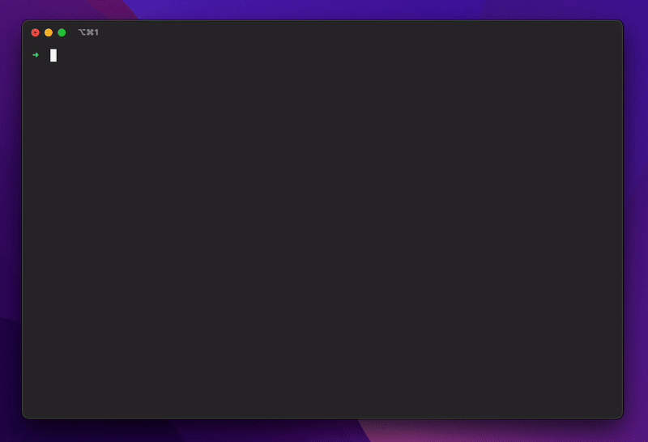

# dotfiles

Minimal yet powerful zsh configuration with **modular architecture** - install only the tools you need.



## Quick Start

```bash
curl -sL https://raw.githubusercontent.com/jcyamacho/dotfiles/main/install.sh | sh
```

After installation, install tools on-demand:

```bash
install-node     # Node.js via fnm
install-rust     # Rust toolchain
install-code     # VS Code + utilities
install-codex    # Codex CLI (OpenAI)
update-all       # Update all installed tools
```

## Available Tools

| Tool | Install | Update | Features |
|------|---------|--------|----------|
| **Development Tools** ||||
| [VS Code](https://code.visualstudio.com/) | `install-code` |  | `c()` alias |
| [Cursor](https://www.cursor.com/) | `install-cursor` |  | `cr()` alias |
| [Zed](https://zed.dev/) | `install-zed` |  | `zd()` alias |
| **Languages** ||||
| [Go](https://go.dev/) | `install-go` |  | `gmt()`, `gmi()` + linter |
| [Rust](https://www.rust-lang.org/) | `install-rust` | `update-rust` | Via rustup |
| [Zig](https://ziglang.org/) | `install-zig` |  | Latest stable |
| [Ruby](https://www.ruby-lang.org/) | `install-rbenv` | `update-ruby` | Via rbenv, auto latest, `uninstall-unused-ruby-versions` |
| **JavaScript/TypeScript** ||||
| [Node.js](https://nodejs.org/) | `install-node` | `update-node` | Via fnm, auto LTS, `uninstall-unused-node-versions` |
| [Bun](https://bun.sh/) | `install-bun` | `update-bun` | Fast runtime |
| [Deno](https://deno.com/) | `install-deno` | `update-deno` | Secure runtime |
| **Python** ||||
| [Python](https://www.python.org/) | `install-python` | `update-python` | uv + ruff + basedpyright, `act()` |
| **AI & CLI** ||||
| [Claude Code](https://www.anthropic.com/claude-code) | `install-claude` | `update-claude` | + agents & commands |
| [Gemini CLI](https://github.com/google/gemini-cli) | `install-gemini` | `update-gemini` | Google's AI CLI |
| [Fabric AI](https://github.com/danielmiessler/fabric) | `install-fabric-ai` |  | Patterns, `yt()` |
| [Codex CLI](https://developers.openai.com/codex/cli) | `install-codex` | `update-codex` | OpenAI coding CLI, `cdx()` |
| [Ollama](https://ollama.com/) |  | `update-ollama-models` | Model updates |
| **Development Environment** ||||
| [mise](https://mise.jdx.dev/) | `install-mise` | `update-mise` | Dev tools, env vars, task runner, `uninstall-mise` |
| [direnv](https://direnv.net/) | `install-direnv` | `update-direnv` | Per directory env vars, `uninstall-direnv` |
| **Utilities** ||||
| [zoxide](https://github.com/ajeetdsouza/zoxide) | `install-zoxide` | `update-zoxide` | Smarter cd command, `uninstall-zoxide` |
| [bat](https://github.com/sharkdp/bat) | `install-bat` |  | Enhanced cat |
| [GitHub CLI](https://cli.github.com/) | `install-gh` |  | + completions |
| [jq](https://jqlang.org/) | `install-jq` |  | JSON processor |
| [Fonts](https://github.com/ryanoasis/nerd-fonts) | `install-fonts` |  | Dev fonts |

## What's Included

### Core (Automatic)

- Antidote plugin manager with curated bundle (`.zsh_plugins.txt`) for git, navigation tools, syntax highlighting, autosuggestions
- Starship prompt (plain text preset)
- Essential utilities
- Platform package managers

### Optional (On-Demand)

Each tool in `scripts/` provides:

- `install-<tool>` and `uninstall-<tool>` functions
- Consistent environment setup
- Update integration where supported
- Clean removal
- Scripts run on every platform; guard OS-specific logic inside the script. Name files `<tool>.sh`—suffix conventions (e.g., `foo-mac.sh`, `foo-linux.sh`, or `foo.mac.sh`) are not sourced automatically.

## Usage Examples

```bash
# Install languages
install-rust && install-go && install-python

# Install editors
install-code && install-cursor

# Use convenience features
c ~/project          # Open in VS Code
gmt                  # Go mod tidy
act                  # Activate Python venv
yt <youtube-url>     # Process transcript
cdx "add docs section"   # Codex CLI helper

# Management
update-all           # Update everything
uninstall-cursor     # Clean removal
```

## Customization

### Configuration Commands

- `zcustomconfig` - Edit personal configurations (`~/.zcustom`)
- `zshconfig` - Edit main zsh configuration
- `starshipconfig` - Edit prompt configuration

### Custom Configuration

Create personal configs that won't be overridden:

```bash
zcustomconfig  # Opens ~/.zcustom in your editor

# Add your personal settings:
export MY_VAR="value"
alias my-cmd="command"
```

### Plugin Bundle

Antidote reads its bundles from `.zsh_plugins.txt`. Edit that file to add or remove plugins, then run `update-antidote` (or `update-all`) to rebuild the cached `.zsh_plugins.zsh` before restarting your shell.

## Core Functions

- Command detection uses zsh's `$+commands[cmd]` idiom (replaces the legacy `exists` helper)
- `mkcd <dir>` - Create and cd to directory
- `update-dotfiles` - Refresh from repository
- `update-antidote` - Rebuild Antidote cache after editing `.zsh_plugins.txt`
- `update-all` - Run every registered update hook (Antidote, Starship, dotfiles, brew, tool scripts)
- `update-brew` - Update Homebrew packages (macOS)

## Why Modular?

- **Selective**: Install only what you need
- **Independent**: Each tool isolated, no conflicts
- **Maintainable**: Easy updates and removal
- **Transparent**: Clear understanding of what's installed

Perfect for developers who want control without complexity.
